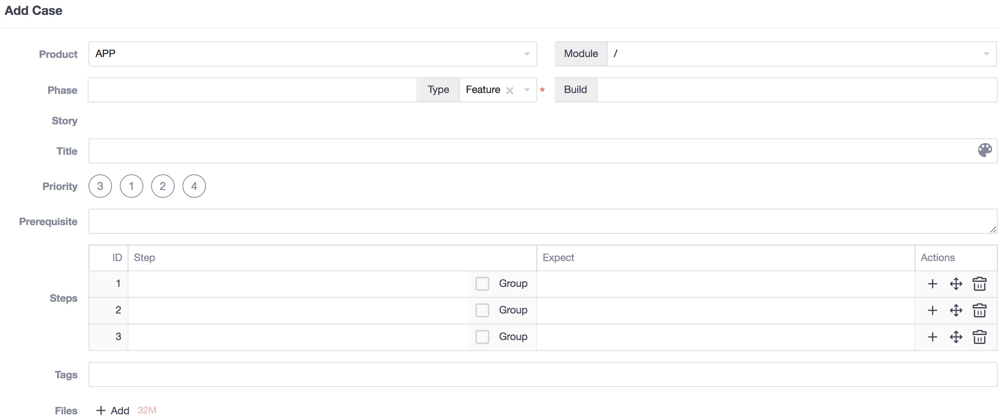

# Parrot

**Automated test solution for http requests based on recording and playback**

## 1. Instructions for use

### 1.1 Install

The Parrot project is developed based on Python 3， and the recommended version is 3.7.x. Please ensure that the corresponding version of python environment is installed on the target machine.

**Method One: install via `pip` command**

iParrot project has been submitted to PyPI.

1. You could install via `pip install iParrot` command.
2. If you need a upgrade, try `pip install -U iParrot` command.

**Method Two: install using source code**

Code Repository: <https://github.com/idle-man/iParrot>

Download source code pkg and install via `python setup.py install` command.

After the installation is complete, the `parrot` executable will be generated, try `parrot help` or `parrot -v`. If there is a problem, feedback an issue: <https://github.com/idle-man/iParrot/issues>

***

### 1.2 Usage

#### 1.2.1 View commands supported by Parrot: `parrot help`

Two core commands are: **record** and **replay**

```
$ parrot help
Automated test solution for http requests based on recording and playback
Version: ...

Usage: parrot [-h] [-v] [command] [<args>]

command:
  record - parse source file and generate test cases
      see detail usage: `parrot help record`
  replay - run the recorded test cases and do validations
      see detail usage: `parrot help replay`

optional arguments:
  -h, --help         show this help message and exit
  -v, -V, --version  show version
```

#### 1.2.2 View usage of `record`: `parrot help record`

The purpose of this step is to parse the user-specified source file (currently .har) into a standardized set of use cases.

```
$ parrot help record
...

Usage: parrot record [<args>]

Arguments:
  -s, --source SOURCE   source file with path, *.har or directory [required]
  -t, --target TARGET   target output path, 'ParrotProject' as default
  -i, --include INCLUDE include filter on url, separated by ',' if multiple
  -e, --exclude EXCLUDE exclude filter on url, separated by ',' if multiple
  -vi, --validation-include V_INCLUDE
                        include filter on response validation, separated by ',' if multiple
  -ve, --validation-exclude V_EXCLUDE  
                        exclude filter on response validation, separated by ',' if multiple
  -ae, --auto-extract   automatic identification of interface dependencies or not, False as default
  
  --log-level LOG_LEVEL log level: debug, info, warn, error, info as default
  --log-mode  LOG_MODE  log mode : 1-on screen, 2-in log file, 3-1&2, 1 as default
  --log-path  LOG_PATH  log path : <project path> as default
  --log-name  LOG_NAME  log name : parrot.log as default

```

#### 1.2.3 View usage of `replay`: `parrot help replay`

This step is to execute the specified set of test cases and generate a test report.

```
$ parrot help replay
...

Usage: parrot replay [<args>]

Arguments:
  -s, --suite, -c, --case SUITE_OR_CASE
                        test suite or case with path, *.yml or directory [required]
  -t, --target TARGET   output path for report and log, 'ParrotProject' as default
  -i, --interval INTERVAL
                        interval time(ms) between each step, use the recorded interval as default
  -env, --environment ENVIRONMENT
                        environment tag, defined in project/environments/*.yml, use defined config in test_suites as default
  -reset, --reset-after-case
                        reset runtime environment or not, False as default

  --fail-stop           stop or not when a test step failed on validation, False as default
  --fail-retry-times FAIL_RETRY_TIMES
                        max retry times when a test step failed on validation, 0 as default
  --fail-retry-interval FAIL_RETRY_INTERVAL 
                        retry interval(ms) when a test step failed on validation, 100 as default
                        
  --log-level LOG_LEVEL log level: debug, info, warn, error, info as default
  --log-mode  LOG_MODE  log mode : 1-on screen, 2-in log file, 3-1&2, 1 as default
  --log-path  LOG_PATH  log path : <project path> as default
  --log-name  LOG_NAME  log name : parrot.log as default

```

***

### 1.3 Demo

#### 1.3.1 Build Sample application and export HAR

In order to facilitate the function debugging and operation demonstration, a simple web application(based on Python Flask) was specially built: <https://github.com/idle-man/ParrotSample>

Please refer to its README to complete the application setup in the local environment. It provides the "recommended function operations".

We use this as an example, using the browser's developer tools, after completing this series of operations, export the HAR file, assuming we named it `sample.har` and placed it in your working directory.

> HAR is a common standardized format for storing HTTP requests and responses.
> 
> Its versatility: can be exported with consistent format from Charles, Fiddler, Chrome, etc.
> 
> Its standardization: JSON format and UTF-8 coding.

***

#### 1.3.2 Record, transforming HAR into standardized use cases

We assume that you have completed the installation of `parrot` as described in Chapter 1. Now we use the command line tool on the computer and switch to the path where `sample.har` is located.

> It is recommended to use `PyCharm`, which contains `Terminal`, which is convenient for operation and helps to view the following use cases.

According to the instructions in Section 1.2.2, we have a general understanding of the basic usage of the `record` command. Now let's make a try on `sample.har`.

**# A simple record: -s & -t**

```
$ parrot record -s sample.har -t demo0
```

If it is successful, after the execution is complete, you will see the generated use cases set in current directory. The structure is as follows:

```
demo0/
  ├── environments
  │    └── *env*.yml: Project-level environment variable configuration
  ├── test_steps
  │    └── *case_name*.yml: The minimum execution unit, a http request is a step
  ├── test_cases
  │    └── *case_name*.yml: Independent closed-loop unit,  consisting of one or more steps
  └── test_suites
       └── *suite_name*.yml: Test case set, consisting of one or more cases
```

Each `Entry` in HAR will be converted into a test_step containing the specific request and validation information.

Each `test_step` `test_case` `test_suite` contains its own `config` `setup_hooks` `teardown_hooks`.

The specific format can be found in the `Appendix: Use Case Structure`.

**# Not all recorded requests need to be converted to use cases: -i & -e**

Because HAR is a full export without selection, it may contain some requests that we don't need to test, such as `*.css` `*.js`. In order to avoid the manual processing, we can filter them out during the record phase.

Parrot currently provides -i/--include and -e/--exclude filter modes, specifically:

* -i, --include: According to the specified parameters, the `url` in each `Entry` is ambiguously matched, and the matching will be retained. The relationship between multiple include parameters is OR.
* -e, --exclude: According to the specified parameters, the `url` in each `Entry` is ambiguously matched, and the matching will be excluded. The relationship between multiple excludes is OR.

The two parameters can be used only in one or in combination to achieve your filtering needs.

In our above requirement, we want to filter out the unwanted `*.css` and `*.js`, just use -e, --exclude.

```
$ parrot record -s sample.har -t demo1 -e ".css, .js"
```

After that, you can check if the requirement is met in demo1/test_steps.

**# Not all content in response can be expected: -vi & -ve**

An example of the validations generated in test_step, the user can also customize this format:

```
validations:
- <comparator>:
    <check>: <expected result>
```

The `check`: According to the important information in the above Mode One, the unified format is: \<PREFIX>.\<KEYS>

- Available PREFIX: `status`, `content`, `headers`, `cookies`, in lower case
- KEYS in `status`: `code`
- KEYS in `headers` and `cookies`: Currently only extracting the outer keys
- KEYS in `content`(json format): `content.a.b[1].c`

**By default, automatically generated validations will include `status.code` and all keys of `content` and unofficial keys of  `headers`.**

In fact, some of these keys do not need to be verified for reasons such as variability, etc., such as the `tag` `timestamp` contained in the response information of each request in `sample.har`, which is best removed when it is automatically generated.

Parrot currently provides -vi/--validation-include and -ve/--validation-exclude filter modes, specifically:

* -vi, --validation-include: According to the specified parameters, the `headers` and `content` in the response in each Entry are fuzzy matched, and the matching will be retained. The relationship between multiple -vi is OR.
* -ve, --validation-exclude: According to the specified parameters, the `headers` and `content` in the response in each Entry are fuzzy matched, the matching will be excluded. The relationship between multiple -ve is OR.

The two parameters can be used only in one or in combination to achieve your filtering needs.

In our above requirement, we want to filter out unwanted `tag` and `timestamp`, just use -ve, --validation-exclude.

```
$ parrot record -s sample.har -t demo2 -e ".css, .js" -ve "content.tag, timestamp"
```

About the `comparator`, the default is `eq` when it is automatically generated, which can be edited manually. Currently, to view all the comparators that parrot supports, see `Appendix: Verification Method Set`.

**# Sometimes we need to generate the parameters in real time.**

Take the `hobby_suggest` request in `sample.har` as an example. The `today` parameter of the interface needs the date of the execution time. The default value recorded by the recording is the static value. If we run it in the next day, it will not meet the requirements. At this point, you need to generate this parameter in real time.

The way Parrot supports is: `${{function(params)}}`, where those functions are provided in `iparrot.modules.helper`, which can be used directly. See `Appendix: Helper Method Set`.

Example:

```yaml
config:
  ...
  variables:
    p1: ABC
    p2: 123
    p3: ${{today()}}
request:
  method: GET
  ...
  params:
    param1: ${p1}
    param2: ${p2}
    today: ${p3}
  ...
```

**# Sometimes there is a dependency on the response of the previous request.**

Take the `hobby_detail` request in `sample.har` as an example. Its `name` argument is from the real-time valid return in the `hobby_list` request's response. If the data during recording is directly played back, it is likely that there is a failure sometimes.

Parrot's solution is: `extract` the specific key in the response of the `hobby_list` request, and use the `${variable}` format in the `hobby_detail` request.

Example:

hobby_list:

```yaml
config:
  ...
request:
  ...
response:
  extract:
    hobby: content.hobbies[0].name
...
```

hobby_detail:

```yaml
config:
  ...
request:
  ...
  params:
    name: ${hobby}
  ...
```

In iParrot 1.0.6 and later, `parrot record` has the `-ae, --auto-extract` parameter added. 

If this parameter is specified, parrot will automatically recognize the parameter dependency between interfaces during the parsing process.

The `extract` extraction and `${variable}` references are automatically completed when the use cases are generated.

In view of the possibility of many formats in the actual scene, the 'automatic' identification may cause some accidental or omission, and it is recommended to perform artificial inspection and correction after its execution.

Regarding the recording phase, the above scenarios should cover most of the use cases. If there are other unsupported questions, welcome feedback an issue: <https://github.com/idle-man/iParrot/issues>

***

#### 1.3.3 Replay, execute use cases, verify result, generate report

According to the instructions in Section #1.2.3, we have a general understanding of the basic usage of the `replay` command. Now let's try to play back the `demo2` recorded earlier.

**# A simple replay: -s & -t**

```
$ parrot replay -s demo2/test_suites -t demo2
```

If it is successful, the process output information will be visible on the screen during the execution. After the execution is completed, you will see the generated test report in the `demo2` directory: `parrot_<timestamp>.html`, which could be  viewed via PyCharm or browser.


**# About the running order**

Parrot execute the test in the order of cases and steps defined in *test_suite*.yaml / *test_case*.yaml, currently only supports serial execution mode.

> When the use case is automatically generated, the order of the steps defaults to the order of appearance in the recorded sample, which can be edited manually.

The detailed execution process:

```
test_suite1
 |-> suite1.setup
 |-> test_case1
   |-> case1.setup
   |-> test_step1
     |-> step1.setup
     |-> request
     |-> validation
     |-> extract
     |-> step1.teardown
   |-> test_step2
     ...
   |-> case1.teardown
 |-> test_case2
   ...
 |-> suite1.teardown
test_suite2
  ...
```

**# About the running interval**

The value of `interval` argument is firstly used, otherwise the value `time.start` in step defination.

If the playback pass parameter specifies the `interval`, it will execute according to the interval (in milliseconds), for example:

```
$ parrot replay -s demo2/test_suites -t demo2 -i 100
```

Otherwise, if `time.start` is defined in the request of step (the recording phase will be automatically recorded), the default is to execute according to the interval of `time.start` of each step.

> When the use case is automatically generated, the actual execution time would be recorded as `time.start` in the step defination.

**# About the running validation**

As mentioned in the recording phase, each request generates some validations, which contain the expected result.

In the process of request playback, parrot can get the actual result in real time, so you can check the result in real time, and then check whether the value of each `check` object conforms to the `comparator` rule. If there is one failure, the entire step fails.

After a single step fails, the current Parrot does not terminate the execution of the playback by default, but the user can perform some intervention by running the parameters:

- --fail_stop: If specified, the operation will be terminated after a step verification fails
- --fail\_retry_times: The number of retries after a step failed, 0 as default
- --fail\_retry_interval: retry interval after a step failure

***

#### 1.3.4 Adapting multiple sets of environments

Parrot draws on Postman's environmental management mechanism.

##### The environment configuration is automatically reserved during recording and can be edited manually.

Take the recorded demo2 in section 1.3.2 as an example. The automatically generated environment is configured as `demo2/environments/sample_env.yml`. The default generated content is reserved for several sets of environment identifiers and the content is empty:

```
development: {}
global: {}
production: {}
test: {}
```

At the same time, the `config` part of the automatically generated test\_suites, test\_cases and test\_steps is referenced by `import` and `environment: global`, which can be edited manually.

> `global` is globally shared, the rest are independent, and the new environment identifier can be customized.

Suppose we have deployed multiple sets of `ParrotSample` applications, which represent different operating environments, separated by port number:

```
development: 8081
test: 8082
production: 8080
```

We hope that the same set of test cases can be reused in different environments. We can do like below:

Firstly, edit `demo2/environments/sample_env.yml`:

```
development:
  host: 10.10.100.100:8081
global:
  host: 10.10.100.100:8080
production:
  host: 10.10.100.100:8080
test:
  host: 10.10.100.100:8082
```

Then, manually replace all the values ​​of the `host` in all generated test_steps ymls with the `${host}` variable reference.

##### Multiple sets of environment switching during playback

As mentioned in Section 1.2.3, the `parrot replay` command provides the `-env, --environment` parameter, which specifies the selected environment identifier at execution time.

```
$ parrot replay -s demo2/test_suites -t demo2 -env development
```

Currently, the environment reference is included in the config of test\_suites/test\_cases/test\_steps, and the `replay` parameter can also be specified. The load priority is:

**parameter > test\_suite.config > test\_case.config > test\_step.config**

***

## 2. Design ideas: starting from the original meaning of software testing

### 2.1 How to define software testing

**Classic definition of software testing:**

> The process of using a **manual** or **automated** means to run or measure a software system, the purpose of which is to verify that it meets **specified requirements** or to clarify the difference between **expected** and **actual** results.
>
>   -- *Software engineering terminology from IEEE in 1983*

**A simplified definition:** 
> The process of running a system or application in accordance with defined requirements/steps, obtaining **actual result**, and comparing with the **expected result**.

***

### 2.2 How to do software testing

Let's take the use case template of the ZenTao project management platform as an example. Everyone's daily use case design is basically similar, see the figure below:



If we want to extract key elements from it, based on the definition of software testing, we can easily find the following content:

* `Steps`
* `Expect` of each `Step`
* Sometimes, in order to ensure complete execution, it is possible to add `Prerequisite`

Other elements are usually designed to make use cases easier to manage. Think about it, do we usually do like this?

***

### 2.3 How to automate software testing

We use HTTP(S) interface test as an example to automate. There are usually two ways:

#### 2.3.1 Use testing tools, such as: POSTMAN, JMETER

Take Postman as an example. The implementation is roughly as shown in the figure below:


**Advantage of this approach:**

1. Collection > Folder > Request, layered design makes the use case organization clearer
2. With the environment variable management mechanism, it is convenient for common variable extraction and multiple sets of environment switching.
3. `Pre-request Script` and `Tests` support pre- and post-actions, while `Tests` provides a richer validation methods that reduces the coding threshold.

**Insufficient in this way:**

1. The cost of creation is high, and each new Request requires a certain amount of effort to complete the addition, especially the `Query Params` and `Tests` sections. For dependencies between interfaces, it is necessary to write `Pre-request Script` more cumbersomely.
2. The combination and order adjustment between Requests is not convenient enough, especially for Case or Suite with actual business logic.


#### 2.3.2 Write your own automation framework, such as: Python+requests+unittest

The rough implementation, as in the example below:

```
# -*- coding: utf-8 -*-

import requests
import unittest


class TestHttpBin(unittest.TestCase):
    def setUp(self) -> None:
        """do something here"""

    def test_get(self):
        url = 'http://httpbin.org/'
        params = {
            'p1': 'v1',
            'p2': 'v2'
        }
        response = requests.get(url=url, params=params)
        self.assertEqual(response.status_code, 200)

    def test_post(self):
        """do something like test_get"""

    def tearDown(self) -> None:
        """do something here"""


if __name__ == '__main__':
    unittest.main()
```

**Advantage of this approach:**

1. Flexible use case stratification, data-driven, let the use cases be arranged according to their own wishes.
2. `requests` module encapsulates the underlying capabilities, we only need to write business logic code.
3. `unittest` supports pre- and post- actions, while providing a richer verification methods and lowering the coding threshold.

**Insufficient in this way:**

1. The cost of creation/maintenance is high, and each new Request requires a certain amount of effort to complete the coding, especially the more assertions.
2. There are certain technical thresholds for the design and writing of the framework, especially to ensure sufficient ease of use and versatility. For the dependencies between interfaces, the corresponding process variable transfer mechanism needs to be designed.

***

### 2.4 Is there a more convenient way to automate?

Comprehensive #2.3 chapter two kinds of automation methods, a lot of workload is reflected in:

* A large number of Request/TestCase definitions, especially those with more parameters.
* A large number of assertion method definitions, different Request verification points have differences.
* Scenes that depend on other interfaces require more tedious processing of parameter passing.

**"Lazy" is the first driving force of the technological advancement.**

The design idea of ​​the `parrot` tool is to solve the above problems, greatly improve the efficiency of automatic realization, and make automation easier.

* A large number of Request/TestCase definitions can be implemented simply and quickly by `recording`.
* Through `playback` mode, it can support the regular execution of automated use cases, and help you solve problems such as interface dependencies.
* About verification, based on the recorded Request's Response, automatically generate some regular assertions and support secondary editing.

Compare with the definition of software testing:

- Recording: Get/Define specified requirement and **expected result**
- Playback: Perform the recorded script to get the **actual result**
- Verify: Compare the **expected** and **actual** results

**Traffic playback** is a way to automate the realization of **the original definition of software testing**.

The design of this project is based on above idea to automate the interface testing.

## 3. Source Code

### 3.1 GitHub

This project: <https://github.com/idle-man/iParrot>

Its sample project: <https://github.com/idle-man/ParrotSample>

All of them contain a detailed README for your reference.

If you have any questions or suggestions, please feel free to submit an issue within the project.

### 3.2 Framework Structure
```
iparrot/
  ├── modules
  │    ├── helper.py    : A collection of commonly used methods in which the Function can be used in other modules, also supporting the use of ${{function(params)}} in the cases.
  │    ├── request.py   : Execute HTTP(S) request based on `requests` and get the result
  │    ├── validator.py : The verification engine for request's response information, which supports multiple verification rules, as detailed in Validator.UNIFORM_COMPARATOR
  │    ├── logger.py    : Formatted log printing, support for output to screen or log files
  │    └── reportor.py  : Standardized report printing, support for views of summary results and use case execution details
  ├── extension
  │    └── helper.py    : A collection of common methods that can be customized by the user, where the Function supports use as ${{function(params)}} in the cases
  ├── parser.py : Parse the source file, and automatically generate formatted use cases; parse the specified use case set, load into memory
  ├── player.py : Play back the specified set of use cases, execute them in levels, and finally generate a test report
  └── parrot.py : The main script, you can run `python parrot.py help` to see the specific usage

```

## 4. Appendix

### 4.1 Use case structure

Example:

- **environment**

	```yaml
	global: {}
	production: {}
	development: {}
	test: {}
	```
- **test_step**

	```yaml
	config:
	  environment: <environment flag>
	  import: <environment file>
	  name: step name
	  variables:
	    p1: ABC
	    p2: 123
	request:
	  method: POST
	  protocol: http
	  host: x.x.x.x:8000
	  url: /path/of/api
	  params: {}
	  data:
	    param1: ${p1}
	    param2: ${p2}
	  headers:
	    Content-Type: application/json; charset=UTF-8
	  cookies: {}
	  time.start: 1568757525027
	response:
	  extract: {}
	setup_hooks: []
	teardown_hooks: []
	validations:
	- eq:
	    status.code: 200
	- exists:
	    headers.token
	- is_json:
	    content
	- eq:
	    content.code: 100
	```
- **test_case**

	```yaml
	config:
	  environment: <environment flag>
	  import: <environment file>
	  name: case name
	  variables: {}
	setup_hooks: []
	teardown_hooks: []
	test_steps:
	  - <fullname of step1>
	  - <fullname of step2>
	```
- **test_suite**

	```yaml
	config:
	  environment: <evnironment flag>
	  import: <environment file>
	  name: suite name
	  variables: {}
	setup_hooks: []
	teardown_hooks: []
	test_cases: 
	  - <fullname of case1>
	  - <fullname of case2>
	```

***

### 4.2 Verification method set

These methods can be used in validations in specific test_steps, for example:

```yaml
validations:
- eq:
    status.code: 200
- is_json:
    content
- not_null:
    headers.token
- contains:
    content.message: succ
```

**Commonly used verification methods:**

- **eq(equals):**
	- Example: `1 eq 1`, `'a' eq 'a'`, `[1, 2] eq [1, 2]`, `{'a': 1 } eq {'a': 1}`, `status.code eq 200`
	- Usage:
	
		```
		validations:
		- eq:
		    status.code: 200
		- eq:
		    headers.Content-Type: application/json;charset=UTF-8
		- eq:
		    content.data[0].id: 1000
		```
	- Similar methods: `neq`, `lt`, `gt`, `le`, `ge`
- **len_eq(length equals):**
	- Example: `'ab' len_eq 2`, `[1, 2] len_eq 2`, `{'a': 1} len_eq 1`
	- Usage:
		
		```
		validations:
		- len_eq:
		    headers.token: 32
		- eq:
		    content.datalist: 3
		```
	- Similar methods: `len_neq`, `len_lt`, `len_gt`
- **contains:**
	- Example: `'abc' contain 'ab', ['a', 'b'] contain 'a', {'a': 1, 'b': 2} contain {'a': 1}`
	- Usage:
		
		```
		validations:
		- contains:
		    headers.Content-Type: application/json
		- contains:
		    content.message: ok
		```
	- Similar methods: `not_contains`
- **in:**
	- Example: `'a' in 'ab'`, `'a' in ['a', 'b']`, `'a' in {'a': 1, 'b': 2}`
	- Usage:
		
		```
		validations:
		- in:
		    status.code: [200, 302]
		```
	- Similar methods: `not_in`
- **is_false:**
	- Example: `0 is_false`, `'' is_false`, `[] is_false`, `{} is_false`
	- Usage:
		
		```
		validations:
		- is_false:
		    content.datalist
		- is_json:
		    content
		- is_instance:
		    status.code: int
		```
	- Similar methods: `is_true`, `exists`, `is_instance`, `is_json`
- **re(regex):**
	- Example: `'1900-01-01' re r'\d+-\d+-\d+'`
	- Usage:
		
		```
		validations:
		- re:
		    content.data[0].date: r"\d+-\d+-\d+"
		```
	- Similar methods: `not_re`

More methods and instructions can be found in the following way:

```python
import json
from iparrot.modules.validator import Validator

print(json.dumps(Validator.UNIFORM_COMPARATOR, indent=4))

```

***

### 4.3 Helper method set

These methods can be applied to the inside of test_step / test_case / test_suite in the form `${{function(params)}}`, such as: `setup_hooks` `teardown_hooks` `variables`

```python
today(form='%Y-%m-%d'): Get today's date

days_ago(days=0, form='%Y-%m-%d'): Get the date a few days ago

days_later(days=0, form='%Y-%m-%d'): Get the date a few days later

now(form='%Y-%m-%d %H:%M:%S'): Get the current time, accurate to the second

now_ms(form='%Y-%m-%d %H:%M:%S'): Get the current time, accurate to the micro second

now_timestamp(): Get the current timestamp, accurate to the second

now_timestamp_ms(): Get the current timestamp, accurate to the micro second

hours_ago(hours=0, form='%Y-%m-%d %H:%M:%S'): Get the time a few hours ago, accurate to the second

hours_later(hours=0, form='%Y-%m-%d %H:%M:%S'): Get the time a few hours later, accurate to the second

get_file_name(file, ext=0): Intercept the file name of the specified file, no suffix by default

get_file_path(file): Intercept the path of the specified file

make_dir(directory): Generate the specified directory

copy_file(source, target): Copy the specified file to the target path

get_random_integer(length=10, head=None, tail=None): Generate random number, with specified length, head, tail

get_random_string(length=10, simple=1, head=None, tail=None): Generate random string, with specified length, head, tail

get_random_phone(head=None, tail=None): Generate random Chinese phone number, with specified length, head, tail
```

> If the above helper methods do not meet your needs, you can use the following method:
> 
> Define your own module or pip install specified module in your local environment.
> 
> Add `import xxx` or `from xxx import yyy` to the desired step / case / suite `setup_hooks`, 
> 
> then you could use the `${{function(params)}}` format to call the method you want.
> 
> Any questions, you can feedback an issue: <https://github.com/idle-man/iParrot/issues>
> 
> More general helper methods, welcome to contribute code or issues, thanks.

## 5. External reference, thanks
### 5.1 [Postman](https://learning.getpostman.com/)

#### 5.1.1 Environments management
The mechanism is referenced in the `environment` of the Parrot use case structure.

```
A project can be configured with multiple sets of environments to hold some common environment variables.

Variable names are consistent between different environments, and values ​​can vary.

In the use case, you can refer to the variable by means of ${variable}, reducing manual modification.

The switching of the operating environment can be specified in the replay phase by the -env/--environment parameter.
```

#### 5.1.2 Use case layering mode
 - Collection => test_suite
 - Folder => test_case
 - Request => test_step

#### 5.1.3 Pre and post actions
 - Pre-request Script => setup_hooks
 - Tests => teardown_hooks & validations
    
### 5.2 [HttpRunner](https://github.com/httprunner/httprunner)

#### 5.2.1 [HAR2Case](https://github.com/HttpRunner/har2case)

The files processed by Parrot in the first phase are Charles trace and Fiddler txt. The format is quite different, and the parsing of plain text is cumbersome.

Later, in the course of HttpRunner's ideas, I used HAR to reconstruct the record part. At the same time, I made some changes in the parameters.

Inspired by HttpRunner's ideas, the record part is rebuilt, and some paramters are updated.

For details, to see `parrot help record` and `iparrot.parser`

#### 5.2.2 Use case layering mode

The use case layering mode of HttpRunner, TestSuite>TestCase>TestStep, is clear and a good reference.

When Parrot automatically generates use cases, it directly implements the layering mode on the directory structure and changes the specific use case structure.

#### 5.2.3 setup hooks & teardown hooks

Parrot reuses this naming scheme, which supports `set variable`, `call function`, `exec code`.

#### 5.2.4 extract variable

Parrot in the first phase uses the mode of `store` and `replace`, which is intended to keep all changes in a configuration file, and does not invade the use case at all. 

In actual use, it is found that the usability is not good and the configuration is slightly cumbersome.

Refer to HttpRunner, return the initiative to the user, and the variable can be extracted according to `extract` defination and used as `${variable}`.

#### 5.2.5 comparator

The first version of Parrot diffs results refer to a  configuration file, only supports `eq` and simple `re`, and the method set is limited.

Now refer to the HttpRunner, automatically generate `eq` comparator when recording, and support a variety of comparator customization.

Comparators in Parrot combines with the common verification methods of HttpRunner and Postman, and a certain supplement.

#### 5.2.6 report

Parrot's test report template directly reuses HttpRunner's report style.


