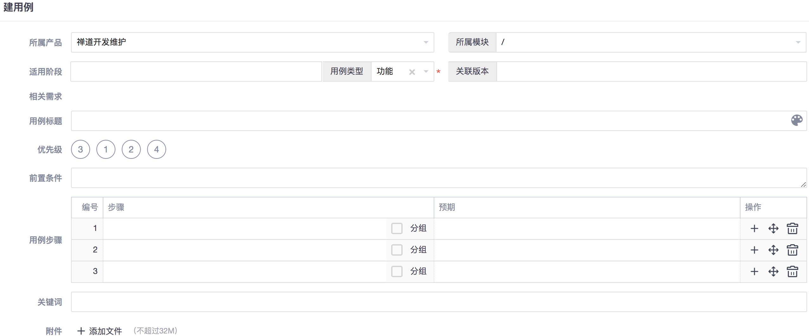
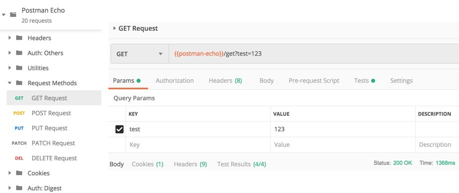

# Parrot(鹦鹉)

**基于录制和回放模式的，面向HTTP请求的自动化测试方案**

## 1. 使用说明

### 1.1 安装部署

Parrot项目基于Python 3开发完成，推荐使用的版本为3.7.x，请确保目标机器上已经安装对应版本的python环境。

**方式一：pip命令安装**

iParrot项目已提交到PyPI：

1. 可使用`pip install iParrot`命令进行安装
2. 如需进行版本升级，可使用`pip install -U iParrot`命令

**方式二：源码安装**

GitHub地址：<https://github.com/idle-man/iParrot>

可下载源码包，使用`python setup.py install`进行安装

安装完成后，会生成`parrot`可执行文件，可尝试`parrot help`或`parrot -v`；如有问题，可反馈Issue：<https://github.com/idle-man/iParrot/issues>

***

### 1.2 用法说明

#### 1.2.1 查看Parrot支持的命令：`parrot help`

其中，两个核心命令分别是：**record - 录制**，**replay - 回放**

```
$ parrot help
Automated test solution for http requests based on recording and playback
Version: ...

Usage: parrot [-h] [-v] [command] [<args>]

command:
  record - 解析源文件，自动生成标准化测试用例
      查看详细用法: parrot help record
  replay - 执行标准化测试用例，验证结果，输出报告
      查看详细用法: parrot help replay

optional arguments:
  -h, --help         show this help message and exit
  -v, -V, --version  show version
```

#### 1.2.2 录制命令的用法：`parrot help record`

该步骤的目的是将用户指定的源文件（目前为.har）解析生成为标准化的用例集

```
$ parrot help record
...

Usage: parrot record [<args>]

Arguments:
  -s, --source SOURCE   源文件, 可附带路径, *.har 或 目录 [必传]
  -t, --target TARGET   用例输出路径, 默认为'ParrotProject'
  -i, --include INCLUDE "包含"过滤器, 模糊匹配url, 若有多个'或'条件请用','分割
  -e, --exclude EXCLUDE "不包含"过滤器, 模糊匹配url, 若有多个'或'条件请用','分割
  -vi, --validation-include V_INCLUDE
                        用于validation生成的"包含"过滤器, 模糊匹配response, 若有多个'或'条件请用','分割
  -ve, --validation-exclude V_EXCLUDE  
                        用于validation生成的"不包含"过滤器, 模糊匹配response, 若有多个'或'条件请用','分割
  -ae, --auto-extract   是否自动识别并提取接口间的传参依赖, 默认'否'
  
  --log-level LOG_LEVEL log level: debug, info, warn, error, info as default
  --log-mode  LOG_MODE  log mode : 1-on screen, 2-in log file, 3-1&2, 1 as default
  --log-path  LOG_PATH  log path : <project path> as default
  --log-name  LOG_NAME  log name : parrot.log as default

```

#### 1.2.3 回放命令的用法：`parrot help replay`

该步骤是执行指定的测试用例集，并生成测试报告

```
$ parrot help replay
...

Usage: parrot replay [<args>]

Arguments:
  -s, --suite, -c, --case SUITE_OR_CASE
                        测试用例/用例集, 可附带路径, *.yml 或 目录 [必传]
  -t, --target TARGET   报告和日志的输出路径, 默认为'ParrotProject'
  -i, --interval INTERVAL
                        请求的间隔时长（毫秒）, 默认使用录制所得的间隔
  -env, --environment ENVIRONMENT
                        环境标识, 定义于project/environments/*.yml中，默认以test_suites中定义的config为准
  -reset, --reset-after-case
                        是否在每个用例执行后重置内存中的环境变量, 默认'否'

  --fail-stop           是否在某个请求失败后停止执行, 默认'否'
  --fail-retry-times FAIL_RETRY_TIMES
                        某个请求失败后的重试次数, 默认为0
  --fail-retry-interval FAIL_RETRY_INTERVAL 
                        某个请求失败后的重试时间间隔（毫秒）, 默认为100
                        
  --log-level LOG_LEVEL log level: debug, info, warn, error, info as default
  --log-mode  LOG_MODE  log mode : 1-on screen, 2-in log file, 3-1&2, 1 as default
  --log-path  LOG_PATH  log path : <project path> as default
  --log-name  LOG_NAME  log name : parrot.log as default

```

***

### 1.3 示例演示

#### 1.3.1 搭建Sample应用，导出HAR

为了方便开发过程中的功能调试和现在的操作演示，特意搭建了一个简单的Web应用（基于Python Flask）：<https://github.com/idle-man/ParrotSample>

请参考其中的README完成本地环境下的应用搭建，同时其中提供了"推荐的功能操作链路"

我们以此为例，利用浏览器的开发者工具，在完成这一系列功能操作后，导出HAR文件，假设我们将其命名为`sample.har`并将其放置在你的工作目录下

> HAR为储存HTTP请求和响应的通用标准化格式
>
> 其通用性体现在：Charles、Fiddler、Chrome等均可导出且格式一致
> 
> 其标准化体现在：JSON格式和UTF-8统一编码

***

#### 1.3.2 录制，将HAR转化为标准化用例

我们假设您已经按照第1章的说明，完成了parrot的安装；现在我们利用电脑上的命令行工具，并且切换到`sample.har`所在的路径下

> 推荐使用PyCharm，内含Terminal，方便操作，同时有助于后续的用例查看

根据#1.2.2节的说明，我们大致了解了`record - 录制`命令的基本用法，现在我们尝试处理一下`sample.har`

**# 最简单的录制操作: -s & -t**

```
$ parrot record -s sample.har -t demo0
```
顺利的话，执行完成后，你会在当前目录下见到生成的用例集，结构大致如下：

```
demo0/
  ├── environments
  │    └── *env*.yml：项目级环境变量配置
  ├── test_steps
  │    └── *case_name*.yml：最小执行单元
  ├── test_cases
  │    └── *case_name*.yml：独立闭环单元
  └── test_suites
        └── *suite_name*.yml：测试用例集合
```

HAR中的每一个`Entry`会转化为一个`test_step`，内含该请求具体的`request`和`validations`信息

每个`test_step``test_case``test_suite`中均包含`config``setup_hooks``teardown_hooks`

具体格式，可以参见`附录：用例结构`部分

**# 并不是所有录制的请求都需要转化为用例: -i & -e**

因为HAR是无选择的全量导出，其中可能包含一些我们并不需要测试的请求，例如`*.css` `*.js`，为了避免后面的人工处理，我们可以在录制阶段过滤掉他们

parrot目前提供了`-i --include/包含`和`-e --exclude/不包含`两种过滤模式，具体：

* -i, --include: 根据指定的传参，对各个`Entry`中的`url`进行模糊匹配，匹配成功的才会被`留存`，多个`include`传参间是`或`的关系
* -e, --exclude: 根据指定的传参，对各个`Entry`中的`url`进行模糊匹配，匹配成功的会被`排除`，多个`exclude`传参间是`或`的关系

两个参数可以只用其一，也可以结合使用，以求达到你的过滤需求

在我们上方的需求中，希望过滤掉不需要的`*.css`和`*.js`，使用`-e, --exclude`即可

```
$ parrot record -s sample.har -t demo1 -e ".css, .js"
```

之后，可以查看demo1/test_steps中，是否达成了你的需求

**# 并不是response中所有的内容都可以作为预期结果: -vi & -ve**

test_step中生成的validations的示例，用户也可参照该格式进行自定义:

```
validations:
- <comparator>:
    <check>: <expected result>
```

其中的`check`，采用统一格式：<一级前缀>.<组合KEY>

- 一级前缀有：`status`, `content`, `headers`, `cookies`，统一小写
- `status`下的key，目前有：`code`
- `headers`和`cookies`下的key，目前仅提取其外层key
- `content`下的key，目前仅支持json模式，多个层级的写法为：`content.a.b[1].c`

**默认情况下，自动生成的`validations`中会包含`status.code` `headers`下的非官方key `content`下的所有key**

事实上，其中某些key因为易变、边缘等原因，我们并不需要验证，例如`sample.har`中各个请求的response信息中都会包含的`tag` `timestamp`，这些最好在自动生成时就被剔除掉

parrot目前提供了`-vi --validation-include/包含`和`-ve --validation-exclude/不包含`两种过滤模式，具体：

* -vi, --validation-include: 根据指定的传参，对各个`Entry`中的`response`中的`headers`和`content`进行模糊匹配，匹配成功的才会被`留存`，多个`-vi`传参间是`或`的关系
* -ve, --validation-exclude: 根据指定的传参，对各个`Entry`中的`response`中的`headers`和`content`进行模糊匹配，匹配成功的会被`排除`，多个`-ve`传参间是`或`的关系

两个参数可以只用其一，也可以结合使用，以求达到你的过滤需求

在我们上方的需求中，希望过滤掉不需要的`tag`和`timestamp`，使用`-ve, --validation-exclude`即可

```
$ parrot record -s sample.har -t demo2 -e ".css, .js" -ve "content.tag, timestamp"
```

关于`comparator`，自动生成时默认为`eq`，可人为编辑，目前Parrot支持的验证方法(comparator)可参见`附录: 验证方法集`

**# 有时我们需要实时生成的传参**

以`sample.har`中的`hobby_suggest`接口为例，接口的`today`传参需要的是执行时刻的当天日期，录制所默认记录下来的是静态值，改天运行的话就不符合需求了，此时就需要实时生成该参数

Parrot支持的方式为:`${{function(params)}}`，其中的`function`，在iparrot.modules.helper中提供了很多常用的方法，可直接使用，详见`附录：助手方法集`

示例:

```yaml
config:
  ...
  variables:
    p1: ABC
    p2: 123
    p3: ${{today()}}
request:
  method: GET
  ...
  params:
    param1: ${p1}
    param2: ${p2}
    today: ${p3}
  ...
```

**# 有时存在对前序接口响应的依赖**

以`sample.har`中的`hobby_detail`接口为例，它的`name`传参来自于`hobby_list`接口响应中的实时有效返回，如果直接回放录制时的数据，很可能有失效的情况出现

Parrot的解决方案为：可在`hobby_list`接口的`response`中配置`extract`提取特定的key，在`hobby_detail`接口的`request`中采用`${variable}`的格式进行引用

示例：

hobby_list接口：

```yaml
config:
  ...
request:
  ...
response:
  extract:
    hobby: content.hobbies[0].name
...
```

hobby_detail接口：

```yaml
config:
  ...
request:
  ...
  params:
    name: ${hobby}
  ...
```

在iParrot 1.0.6及后续版本中，`parrot record`增加了`-ae, --auto-extract`参数，若指定该参数的话，则parrot会在解析过程中自动识别接口间的传参依赖，并在生成用例时自动完成`extract`提取和`${variable}`引用。

鉴于实际场景中存在诸多格式的可能性，该`自动`识别可能会造成一些误伤或遗漏，建议在执行之后进行人为的检查和矫正。

关于`录制`阶段，上述场景应该可以覆盖大部分的业务场景了，如果有其他未支持的问题，欢迎反馈Issue：<https://github.com/idle-man/iParrot/issues>

***

#### 1.3.3 回放，执行用例，验证结果，生成报告

根据#1.2.3节的说明，我们大致了解了`replay - 回放`命令的基本用法，现在我们尝试回放一下前面录制的`demo2`

**# 最简单的回放操作: -s & -t**

```
$ parrot replay -s demo2/test_suites -t demo2
```
顺利的话，执行过程中屏幕可见过程输出信息，执行完成后，你会在demo2目录下见到生成的测试报告：`parrot_<timestamp>.html`，可通过PyCharm或浏览器打开查看详情。


**# 运行的顺序问题**

Parrot的回放执行顺序：按照*test_suite*.yaml / *test_case*.yaml中定义的case和step的次序执行，目前仅支持串行执行模式

> 自动生成用例时，step的排序默认按照录制样本中的出场顺序，可人为编辑

详细的执行流程为：

```
test_suite1
 |-> suite1.setup
 |-> test_case1
   |-> case1.setup
   |-> test_step1
     |-> step1.setup
     |-> request
     |-> validation
     |-> extract
     |-> step1.teardown
   |-> test_step2
     ...
   |-> case1.teardown
 |-> test_case2
   ...
 |-> suite1.teardown
test_suite2
  ...
```

**# 运行的间隔问题**

parrot的执行间隔：优先传参`interval`，默认step的`time.start`

若回放传参指定了`interval`，则按照该间隔执行（单位为毫秒），例如：

```
$ parrot replay -s demo2/test_suites -t demo2 -i 100
```

否则，若step的request中定义了`time.start`(录制阶段会自动记录)，则默认按照各个step的`time.start`的间隔执行

> 自动生成用例时，每个step会记录其实际出场的时间`time.start`，默认按照各个step间的录制间隔执行


**# 关于过程中的验证**

`录制`阶段有讲到，每个请求会生成一些`validations`，其中包含`expected result(预期结果)`

parrot在进行请求回放的过程中，可以实时的拿到`actual result(实际结果)`，因此可以即时的进行结果的校验，依次看各个`check`对象的值是否符合`comparator`规则，**有一项失败则整个step失败**

单个step失败后，目前Parrot默认是不终止回放的执行的，但用户可以通过运行参数进行一些干预：

- --fail_stop: 若指定，则某个step验证失败后即终止运行
- --fail\_retry_times: 某个step失败后的重试次数，默认不重试
- --fail\_retry_interval: 某个step失败后重试间隔时间

***

#### 1.3.4 适配多套环境的场景

Parrot借鉴了Postman的环境管理机制

##### 录制时自动预留了environment配置，可手工编辑

以我们在1.3.2章节录制的demo2为例，自动生成的环境配置为`demo2/environments/sample_env.yml`，默认生成的内容预留了几套环境标识，内容为空，如：

```
development: {}
global: {}
production: {}
test: {}
```

同时在自动生成的test\_suites，test\_cases和test\_steps中的`config`部分通过`import`和`environment: global`进行了默认引用，这些都可以被手工编辑

> global为全局共用，其余各自独立，也可自定义新的环境标识

假设我们部署了多套`ParrotSample`应用，分别代表了不同的运行环境，以端口号做区分：

```
开发环境：8081
测试环境：8082
生产环境：8080
```

我们希望同一套测试用例在不同的环境下是可以被复用的，我们可以这样做

首先，修改`demo2/environments/sample_env.yml`:

```
development:
  host: 10.10.100.100:8081
global:
  host: 10.10.100.100:8080
production:
  host: 10.10.100.100:8080
test:
  host: 10.10.100.100:8082
```

然后，手工将所有test_steps中的yml中录制生成的`host`的值全部替换为`${host}`变量引用

##### 回放时可以进行多套环境的切换

在1.2.3章节有讲到，`parrot replay`命令提供了`-env, --environment`参数，可以在执行时指定所选的环境标识，如：

```
$ parrot replay -s demo2/test_suites -t demo2 -env development
```

目前，在test\_suites/test\_cases/test\_steps的config中均包含环境引用，同时`replay`传参也可以指定，他们的加载优先级是：

**parameter > test\_suite.config > test\_case.config > test\_step.config**

***

## 2. 设计思路：从软件测试本义出发

### 2.1 如何定义软件测试

**软件测试的经典定义：**

> 使用**人工**或**自动**的手段来运行或测定某个软件系统的过程，其目的在于检验它是否满足**规定的需求**或弄清**预期结果**与**实际结果**之间的差别
>
>   -- *来自1983年，IEEE提出的软件工程术语*

**我们对该定义进行一些简化：**
> 按照规定的需求/步骤，运行系统或应用程序，得到实际结果，和预期结果进行比较的过程

***

### 2.2 你是如何进行软件测试的

我们以禅道项目管理平台的用例模板为例，大家日常进行用例设计的方式基本类似，见下图：



如果要从中提取**关键要素**的话，基于软件测试的定义，我们不难得出如下内容：

* `用例步骤`
* 每个步骤的`预期`
* 有时，为了保证执行完整，还可能加上`前置条件`

相比较而言，其他的元素通常是为了让用例更便于管理而已。
思考一下，我们平时是不是这样做的？

***

### 2.3 你是如何做自动化测试的

我们以HTTP(S)的接口测试为例，进行自动化实现，通常有如下两种方式：

#### 2.3.1 使用测试工具，如：POSTMAN、JMETER等
以Postman为例，实现方式大致如下图所示：



**此方式的优势：**

1. Collection > Folder > Request的分层设计，让用例的组织呈现更清晰
2. 配合Environment变量管理机制，方便进行通用变量提取、多套环境切换
3. `Pre-request Script`和`Tests`支持了前置、后置动作，同时`Tests`提供了比较丰富的验证方法，降低了编码门槛

**此方式的不足：**

1. 创建成本较高，每个新的Request都需要花费一定的精力来完成添加，尤其是`Query Params`和`Tests`部分，对于接口间有依赖的，还需要较繁琐的编写`Pre-request Script`
2. Requests之间的组合、顺序调整不够便捷，尤其对于有实际业务逻辑的Case或Suite


#### 2.3.2 编写自动化框架，如：Python+requests+unittest
大致的实现方式，如下面的示例：

```
# -*- coding: utf-8 -*-

import requests
import unittest


class TestHttpBin(unittest.TestCase):
    def setUp(self) -> None:
        """do something here"""

    def test_get(self):
        url = 'http://httpbin.org/'
        params = {
            'p1': 'v1',
            'p2': 'v2'
        }
        response = requests.get(url=url, params=params)
        self.assertEqual(response.status_code, 200)

    def test_post(self):
        """do something like test_get"""

    def tearDown(self) -> None:
        """do something here"""


if __name__ == '__main__':
    unittest.main()
```

**此方式的优势：**

1. 可以灵活的实现用例分层、数据驱动，让用例按照自己的心意进行编排
2. `requests`module封装好了底层能力，我们只需编写业务逻辑相关即可
3. `unittest`支持了前置、后置动作，同时提供了比较丰富的验证方法，降低了编码门槛

**此方式的不足：**

1. 创建/维护成本较高，每个新的Request都需要花费一定的精力来完成编码，尤其是比较多的`Assert`断言
2. 框架的设计和编写有一定的技术门槛，尤其要保证足够的易用性和通用性的话；对于接口间有依赖的，还需要设计相应的过程变量传递机制

***

### 2.4 有没有更便捷的自动化测试方法

综合#2.3章节两种自动化方式的不足，大量的工作量体现在：

* 大量Request/TestCase的定义，尤其是参数较多的请求
* 大量断言方法的定义，不同Request的验证点有差异
* 接口间依赖的场景，需要比较繁琐的处理参数的传递

**"懒"是第一科技进步驱动力**

流量回放工具的设计思路，正是要解决上述问题，大幅提升自动化变现的效率，让自动化可以更简单，具体：

* 通过`录制`方式，可以简单、快速的实现大量Request/TestCase的定义
* 通过`回放`方式，可以支持自动化用例的常规执行，同时帮你解决接口依赖传参等问题
* `验证`方面，以`录制`的Request Response为参考依据，自动生成一些常规的断言，并支持二次编辑

对比软件测试的定义：

- 录制：拿到/定义**规定的需求**和**预期的结果**
- 回放：执行**录制的脚本**，得到**实际的结果**
- 验证：对比**预期的结果**和**实际的结果**

**流量回放**，就是参照**软件测试的原本定义**，进行自动化变现的一种方式

**本项目就是基于该思路进行的接口自动化方案的设计**

## 3. 关于源码

### 3.1 GitHub

本项目：<https://github.com/idle-man/iParrot>

示例站点：<https://github.com/idle-man/ParrotSample>

其中均包含比较详尽的README，可供参照

若有问题或建议，欢迎在项目内提交Issue

### 3.2 Framework Structure
```
iparrot/
  ├── modules
  │    ├── helper.py    : 常用方法集合，其中的Function可用于其他module，同时支持在case中以${{function(params)}}的方式使用
  │    ├── request.py   : 基于`requests`，执行HTTP(S)的请求并拿到结果
  │    ├── validator.py : 针对接口响应信息的验证引擎，支持多种验证规则，详见其中的Validator.UNIFORM_COMPARATOR
  │    ├── logger.py    : 格式化日志打印，支持输出到屏幕或日志文件
  │    └── reportor.py  : 标准化报告打印，可查看汇总结果和用例执行明细
  ├── extension
  │    └── helper.py    : 可由用户自定义的常用方法集合，其中的Function支持在case中以${{function(params)}}的方式使用
  ├── parser.py : 解析源文件，自动生成格式化的用例；解析指定的用例集，load到内存中
  ├── player.py : 回放指定的用例集，按层级执行，最终生成测试报告
  └── parrot.py : 主脚本, 可执行`python parrot.py help`来查看具体用法

```

## 4. 附录

### 4.1 用例结构

示例如下：

- **environment**

	```yaml
	global: {}
	production: {}
	development: {}
	test: {}
	```
- **test_step**

	```yaml
	config:
	  environment: <environment flag>
	  import: <environment file>
	  name: step name
	  variables:
	    p1: ABC
	    p2: 123
	request:
	  method: POST
	  protocol: http
	  host: x.x.x.x:8000
	  url: /path/of/api
	  params: {}
	  data:
	    param1: ${p1}
	    param2: ${p2}
	  headers:
	    Content-Type: application/json; charset=UTF-8
	  cookies: {}
	  time.start: 1568757525027
	response:
	  extract: {}
	setup_hooks: []
	teardown_hooks: []
	validations:
	- eq:
	    status.code: 200
	- exists:
	    headers.token
	- is_json:
	    content
	- eq:
	    content.code: 100
	```
- **test_case**

	```yaml
	config:
	  environment: <environment flag>
	  import: <environment file>
	  name: case name
	  variables: {}
	setup_hooks: []
	teardown_hooks: []
	test_steps:
	  - <fullname of step1>
	  - <fullname of step2>
	```
- **test_suite**

	```yaml
	config:
	  environment: <evnironment flag>
	  import: <environment file>
	  name: suite name
	  variables: {}
	setup_hooks: []
	teardown_hooks: []
	test_cases: 
	  - <fullname of case1>
	  - <fullname of case2>
	```

***

### 4.2 验证方法集

这些方法可用于具体test_step中的`validations`中，例如：

```yaml
validations:
- eq:
    status.code: 200
- is_json:
    content
- not_null:
    headers.token
- contains:
    content.message: succ
```

**常用的验证方法：**

- **eq(equals): 相等**
	- 释义：`1 eq 1`, `'a' eq 'a'`, `[1, 2] eq [1, 2]`, `{'a': 1 } eq {'a': 1}`, `status.code eq 200`
	- 用法：
	
		```
		validations:
		- eq:
		    status.code: 200
		- eq:
		    headers.Content-Type: application/json;charset=UTF-8
		- eq:
		    content.data[0].id: 1000
		```
	- 类似的方法：`neq`, `lt`, `gt`, `le`, `ge`
- **len_eq(length equals): 长度相等**
	- 释义：`'ab' len_eq 2`, `[1, 2] len_eq 2`, `{'a': 1} len_eq 1`
	- 用法：
		
		```
		validations:
		- len_eq:
		    headers.token: 32
		- eq:
		    content.datalist: 3
		```
	- 类似的方法：`len_neq`, `len_lt`, `len_gt`
- **contains: 包含**
	- 释义：`'abc' contain 'ab', ['a', 'b'] contain 'a', {'a': 1, 'b': 2} contain {'a': 1}`
	- 用法：
		
		```
		validations:
		- contains:
		    headers.Content-Type: application/json
		- contains:
		    content.message: ok
		```
	- 类似的方法：`not_contains`
- **in: 被包含**
	- 释义：`'a' in 'ab'`, `'a' in ['a', 'b']`, `'a' in {'a': 1, 'b': 2}`
	- 用法：
		
		```
		validations:
		- in:
		    status.code: [200, 302]
		```
	- 类似的方法：`not_in`
- **is_false: 空**
	- 释义：`0 is_false`, `'' is_false`, `[] is_false`, `{} is_false`
	- 用法：
		
		```
		validations:
		- is_false:
		    content.datalist
		- is_json:
		    content
		- is_instance:
		    status.code: int
		```
	- 类似的方法：`is_true`, `exists`, `is_instance`, `is_json`
- **re(regex): 匹配**
	- 释义：`'1900-01-01' re r'\d+-\d+-\d+'`
	- 用法：
		
		```
		validations:
		- re:
		    content.data[0].date: r"\d+-\d+-\d+"
		```
	- 类似的方法：`not_re`

更多的方法及说明可以采用下面的方式了解：

```python
import json
from iparrot.modules.validator import Validator

print(json.dumps(Validator.UNIFORM_COMPARATOR, indent=4))

```

***

### 4.3 助手方法集

这些方法可被以`${{function(params)}}`的格式应用于test_step / test_case / test_suite的内部，如：`setup_hooks` `teardown_hooks` `variables`

```python
today(form='%Y-%m-%d'): 获取今天的日期

days_ago(days=0, form='%Y-%m-%d'): 获取几天前的日期

days_later(days=0, form='%Y-%m-%d'): 获取几天后的日期

now(form='%Y-%m-%d %H:%M:%S'): 获取当前的时间，精确到秒

now_ms(form='%Y-%m-%d %H:%M:%S'): 获取当前的时间，精确到毫秒

now_timestamp(): 获取当前的时间戳，精确到秒

now_timestamp_ms(): 获取当前的时间戳，精确到毫秒

hours_ago(hours=0, form='%Y-%m-%d %H:%M:%S'): 获取几个小时前的时间，精确到秒

hours_later(hours=0, form='%Y-%m-%d %H:%M:%S'): 获取几个小时后的时间，精确到秒

get_file_name(file, ext=0): 截取指定文件的文件名，默认无后缀

get_file_path(file): 截取指定文件的所在路径

make_dir(directory): 生成指定的目录

copy_file(source, target): 复制指定的文件到目标路径

get_random_integer(length=10, head=None, tail=None): 生成随机数字，可指定长度、头部、尾部

get_random_string(length=10, simple=1, head=None, tail=None): 生成随机字符串，可指定长度、头部、尾部

get_random_phone(head=None, tail=None): 生成随机中国手机号，可指定头部、尾部
```

> 若上述助手方法无法满足您的需求，可以采用如下方式：
> 
> 在您的本地环境下定义自己的module或pip install指定的module
> 
> 在所需的step / case / suite的`setup_hooks`中添加`import xxx`或`from xxx import yyy`，之后就可以继续采用`${{function(params)}}`的格式来使用你想要的方法了
> 
> 如有问题，可反馈Issue: <https://github.com/idle-man/iParrot/issues>
> 
> 更多通用的助手方法，欢迎贡献代码或Issue，感谢

## 5. 外部借鉴，感谢
### 5.1 [Postman](https://learning.getpostman.com/)

#### 5.1.1 环境管理机制

Parrot用例结构中的environment参考了该机制

```
一个项目可以配置多套环境，用来保存一些通用的环境变量，
不同环境之间，变量名保持一致，变量值可有差异，
在用例中通过${variable}的方式引用变量即可，减少手工修改
运行环境的切换，可以在replay阶段通过-env/--environment参数指定即可
```

#### 5.1.2 用例分层模式
 - Collection => test_suite
 - Folder => test_case
 - Request => test_step

#### 5.1.3 前后置动作
 - Pre-request Script => setup_hooks
 - Tests => teardown_hooks & validations

***

### 5.2 [HttpRunner](https://github.com/httprunner/httprunner)

#### 5.2.1 [HAR2Case](https://github.com/HttpRunner/har2case)


Parrot第一版录制解析的对象为Charles.trace和Fiddler.txt，解析略繁琐

后来在HttpRunner的思路借鉴下改用HAR进行了record部分的重构，同时传参方面进行了一些增改

详见`parrot help record`和`iparrot.parser`

#### 5.2.2 用例分层模式

HttpRunner的TestSuite>TestCase>TestStep的分层规则很好，采用拿来主义

Parrot在自动生成时，直接落实到目录结构上，同时对具体的用例结构有所增改

#### 5.2.3 setup hooks & teardown hooks

Parrot复用该命名方式，其中支持`set variable`, `call function`, `exec code`

#### 5.2.4 extract变量提取

Parrot第一版采用store+replace的方式，意在将所有的变化都限制在一个配置文件中，而完全不侵入用例，实际使用中发现易用性不佳，配置略繁琐

参考HttpRunner，将主动权交还给用户，可自行选取变量进行`extract`和`${variable}`引用

#### 5.2.5 comparator

Parrot第一版采用diff结合配置的方式，仅支持`eq`和简单的`re`，方法集有限

现在参考HttpRunner的方式，录制时默认生成`eq`comparator，同时支持多种comparator的自定义，结合了HttpRunner和Postman的常用验证方法，并进行了一定的增补

#### 5.2.6 report

Parrot的测试报告模板直接复用了HttpRunner的报告样式


